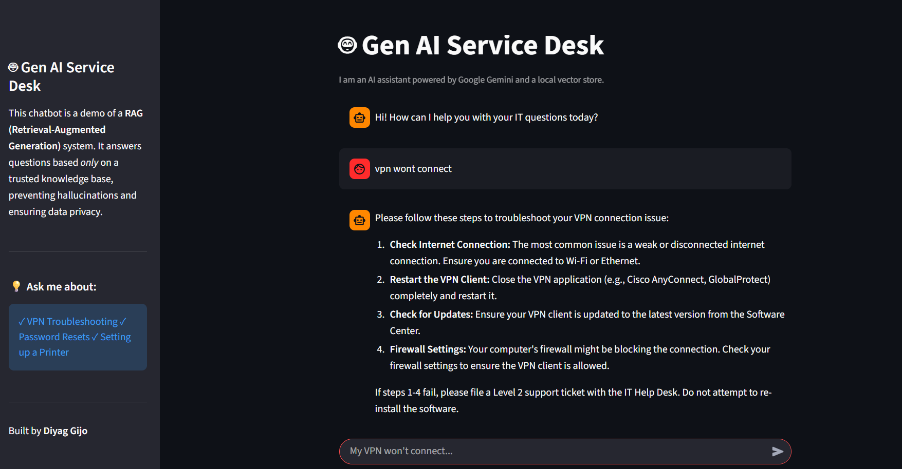

# 🤖 Gen AI-Powered IT Service Desk Agent (RAG)

This is a professional-grade, retrieval-augmented generation (RAG) system built to solve a core business problem for IT service providers.

It automates a Level 1 IT Help Desk by answering employee questions using a trusted, private knowledge base. This reduces ticket volume, prevents AI "hallucinations," and ensures data privacy.


### 💡 The Business Problem (The "Why")

A massive part of UST's business is **IT Services & BPO (Business Process Outsourcing)**. They run the help desks for Fortune 500 companies. This process is expensive, time-consuming, and hard to scale.

A simple "toy" chatbot is not the solution, as it can:
1.  **Hallucinate:** Make up answers and confuse employees.
2.  **Leak Data:** Be trained on (or leak) private company information.

This project solves both of these critical business problems.

### 🛠️ How It Works: The RAG Pipeline

This is an "industrial-strength" AI application, not just a model. It is an end-to-end system built for trust and control.


1.  **Ingest & Store:** On startup, the app loads all `.txt` files from a `knowledge_base/` folder. It uses `SentenceTransformer` to convert them into vector embeddings and stores them in a local, high-speed `FAISS` vector database.
2.  **Retrieve (The "R"):** When a user asks a question, the app searches the vector database for the **Top-1** (`k=1`) most semantically similar document. This ensures only the *most relevant* fact is used.
3.  **Augment & Generate (The "G"):** The app passes this single, relevant document (the "context") to the Gemini API with a strict **System Prompt** that commands it to:
    * Answer *only* using the provided context.
    * Refuse to answer if the information is not present.
4.  **Cite (The "Trust" Feature):** The app displays its answer *and* the source file it used, proving it is not hallucinating and making its answer auditable.

---

### 📸 Dashboard Showcase

#### 1. The "Correct Answer"
The bot correctly retrieves the VPN troubleshooting guide and cites its source.


#### 2. The "Safe Answer" (Anti-Hallucination)
The bot correctly refuses to answer an out-of-scope question, proving its trustworthiness.


---

### 🔧 Tech Stack

* **Gen AI:** Google Gemini API (via direct `requests`)
* **Frontend:** Streamlit
* **Embedding Model:** `sentence-transformers` (all-MiniLM-L6-v2)
* **Vector Database:** `faiss-cpu` (Facebook AI Similarity Search)
* **Backend:** Python

---

### 🏁 How to Run Locally

1.  **Clone the repository:**
    ```bash
    git clone [https://github.com/diyagijo/genai_service_desk.git](https://github.com/diyagijo/genai_service_desk.git)
    cd genai_service_desk
    ```

2.  **Create and activate a virtual environment:**
    ```bash
    python -m venv venv
    .\venv\Scripts\activate
    ```

3.  **Install dependencies:**
    ```bash
    pip install -r requirements.txt
    ```

4.  **Set up your API Key:**
    * Create a `.env` file in the main folder.
    * Add one line: `GOOGLE_API_KEY="YOUR_API_KEY_HERE"`

5.  **Run the app:**
    *(The first time you run this, it will build the `vector_store.index` file.)*
    ```bash
    streamlit run app.py

    ```

